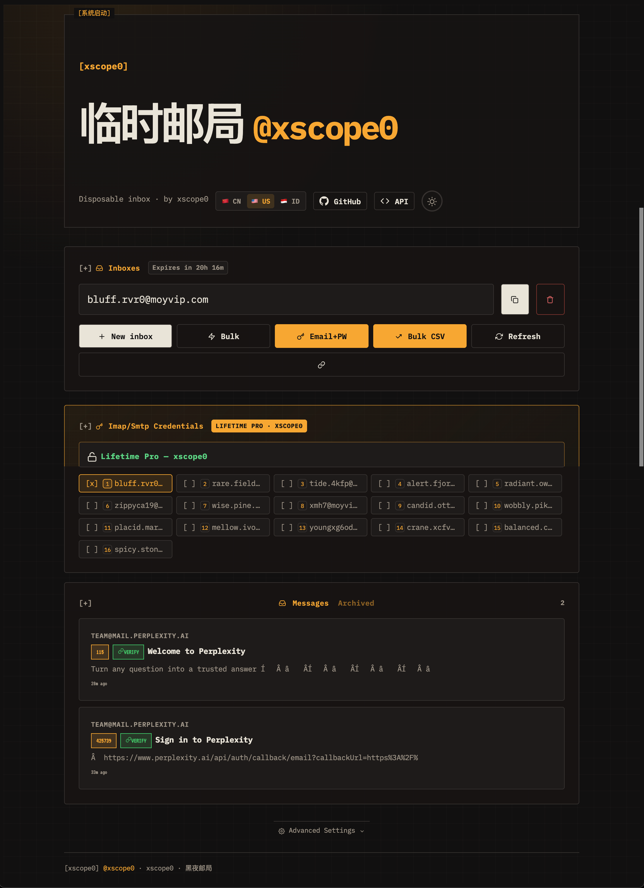

<h1 align="center">temp-mail</h1>

<p align="center">Disposable email. OTP extraction. Zero tracking.</p>

<p align="center">
  
</p>


<p align="center">
  <a href="https://github.com/xscope0/temp-mail/blob/main/LICENSE"></a>
</p>

---

## Quick Start

```bash
git clone https://github.com/xscope0/temp-mail.git
cd temp-mail
cp js/config.example.js js/config.js   # add your Supabase creds
npm install
npm run dev                             # http://localhost:3000
```

No bundler. No framework. Ships as static HTML/CSS/JS.

---

## What It Does

| Feature | Description |
|---------|-------------|
| **Inbox generation** | Instant disposable addresses, no signup |
| **OTP extraction** | Auto-detects 2FA codes, verification links, PINs |
| **Bulk mode** | Create up to 999 inboxes at once |
| **Lifetime Pro** | IMAP/SMTP credentials for persistent inboxes |
| **GitHub helper** | Auto-fill signup fields with temp credentials |
| **Agent API** | Programmatic access via URL params or JS |
| **Multilingual** | English, Chinese, Indonesian |
| **Dark mode** | System preference detection, manual toggle |

---

## Agent API

**URL mode** — append `?api=<action>`:

| Endpoint | Returns |
|----------|---------|
| `?api=generate` | New inbox address |
| `?api=messages&address=x` | Messages for address |
| `?api=otp&address=x` | Extracted OTP code |
| `?api=wait&address=x&t=60` | Long-poll OTP (timeout in seconds) |
| `?api=inboxes` | All session inboxes |
| `?api=domains` | Available domains |

**JS mode** — `window.TempMailAPI`:

```javascript
const inbox = await TempMailAPI.generate();
const code = await TempMailAPI.wait(inbox.address, 60);
```

**ChatGPT plugin** — `.well-known/ai-plugin.json` enables auto-discovery.

---

## Configuration

```bash
cp js/config.example.js js/config.js
```

Edit `js/config.js`:

```javascript
export const SB_URL = 'https://YOUR_PROJECT_ID.supabase.co';
export const SB_ANON_KEY = 'YOUR_ANON_KEY_HERE';
```

Get credentials: **Supabase Dashboard > Project Settings > API**

The anon key is public by design. Security = Supabase RLS policies, not key secrecy. Never use `service_role` in client code.

---

## Tech Stack

| Layer | Tech |
|-------|------|
| Frontend | Vanilla JS (ES modules), CSS custom properties |
| Backend | Supabase (Postgres + Edge Functions + Realtime) |
| Email routing | Cloudflare Workers |
| Hosting | Vercel (static) |
| CDN dependency | `@supabase/supabase-js@2` via esm.sh |

---

## Architecture

```
temp-mail/
├── index.html              # SPA shell
├── tokens.css              # Design tokens (CSS variables)
├── agent-api.json          # OpenAPI spec for AI agents
├── css/
│   ├── theme.css           # Dark mode, color variables
│   ├── layout.css          # Grid, cards, responsive
│   └── components.css      # Buttons, modals, toasts
├── js/
│   ├── config.js           # Supabase creds, constants (gitignored)
│   ├── config.example.js   # Template for config.js
│   ├── state.js            # localStorage state management
│   ├── api.js              # Supabase client, CRUD, realtime
│   ├── otp.js              # OTP extraction engine
│   ├── sanitizer.js        # XSS-safe HTML rendering
│   ├── ui.js               # DOM, events, keyboard shortcuts
│   ├── agent-api.js        # window.TempMailAPI
│   └── app.js              # Init, polling, wiring
├── test/
│   └── otp.test.mjs        # 15 tests, all passing
└── .well-known/
    └── ai-plugin.json      # ChatGPT plugin manifest
```

---

## OTP Extraction

Handles: 4-8 digit codes, "Your code is X", "OTP: X", "PIN: X", bare 6-digit fallbacks, HTML-stripped matching, verification link extraction.

```bash
npm test    # 15/15 passing
```

---

## Deployment

**Vercel:**
```bash
npm i -g vercel
vercel --prod
```

**Any static host:** Upload files to Netlify, Cloudflare Pages, S3, etc. No build step.

---

## Keyboard Shortcuts

| Key | Action |
|-----|--------|
| `N` | New inbox |
| `R` | Refresh |
| `C` | Copy address |
| `D` | Delete inbox |
| `/` | Search |
| `Esc` | Close modal |

---

## License

MIT
